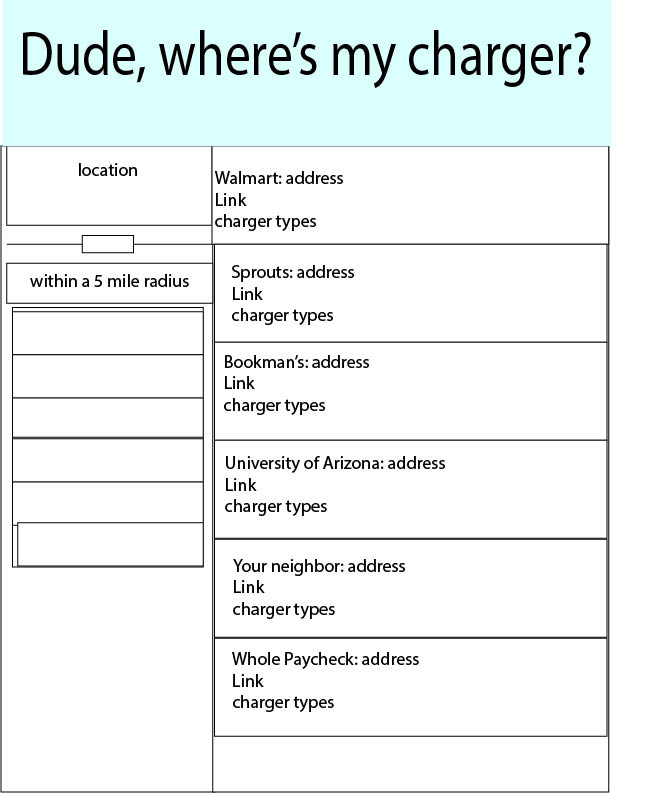

# Dude-wheres-my-charger
This application was created to have an electric car owner who is looking for charging stations in a specific location area (cities).The application will be utilizing free API's for an open charge and an api for forward geo coding.

USER STORY:
As an electric car owner
I want to find charge outlets for my vehicle 
By location with a specific radius 
So I can be flexible with my travel plans with a city location.

When I search the location
Then a selection of charge stations are populated on the screen

When I click on the address 
Then it takes me to google maps.

API links that are used :
https://openchargemap.org/site/develop/api
https://positionstack.com/

*If there is a time, free vs. membership with a charging station.

This application will utilize:HTML, CSS, Javascript, and Tailwind.

#vanlife